# RealWorks Asset Library — Conversion Pipeline

```mermaid
flowchart TD
    %% ─────────────────────────────────────────────
    %% ENTRY POINTS
    %% ─────────────────────────────────────────────
    subgraph ENTRY["Entry Points (React UI)"]
        direction TB
        E1["📁 File Picker\nimportAsset()"]
        E2["📂 Folder Picker\nimportFolder()"]
        E3["🖱️ Drag & Drop\nonDragDropEvent()"]
    end

    E1 & E2 & E3 --> CTX

    %% ─────────────────────────────────────────────
    %% FRONTEND STATE MACHINE
    %% ─────────────────────────────────────────────
    subgraph CTX["AppContext · convertAsset(path, isBatch)"]
        direction TB
        C1["Create asset stub\nstatus = Processing\nprogress = 0\nid = job-{timestamp}"]
        C2["invoke('convert_asset')\nvia Tauri IPC bridge"]
        C3{Await result}
        C4["status = Completed\nprogress = 100\nloadAssets() ← re-reads SQLite"]
        C5["status = Failed\ntoast.error + log entry"]
        C1 --> C2 --> C3
        C3 -- success --> C4
        C3 -- error --> C5
        PROG["⏱ Progress ticker\n+2–7% / second\nup to 90% max (simulated)"]
    end

    %% ─────────────────────────────────────────────
    %% RUST BACKEND
    %% ─────────────────────────────────────────────
    subgraph RUST["Tauri Backend · convert_asset (Rust / main.rs)"]
        direction TB
        R1{is_batch?}
        R2["Scan folder\nfilter by extension\nbuild file list"]
        R3["Single file path"]
        R4["Validate settings\nblender_path, library_path"]
        R5["Spawn Blender subprocess\n--background --python convert.py\n-- input output_dir Uncategorized\n   debug_blend gemini_key provider\n   model url freecad_path"]
        R6["Stream stdout\nline by line"]
        R7{Line starts with\nQUEUE_MANIFEST?}
        R8["Parse JSON manifest\n[{name, category}, ...]"]
        R9["Emit 'queue-manifest'\nevent to frontend"]
        R10{Exit code 0?}
        R11["Read metadata.json\nfor each asset"]
        R12["INSERT OR REPLACE INTO assets\nSQLite · rusqlite\nid, name, category, tags, path,\nthumbnail, source_format,\nneeds_review, profile_confidence"]
        R13["Return Err(stdout)\nto frontend"]

        R1 -- yes --> R2 --> R4
        R1 -- no --> R3 --> R4
        R4 --> R5 --> R6 --> R7
        R7 -- yes --> R8 --> R9 --> R6
        R7 -- no --> R6
        R6 -- stdout closed --> R10
        R10 -- yes --> R11 --> R12
        R10 -- no --> R13
    end

    C2 --> R4

    %% ─────────────────────────────────────────────
    %% BLENDER PIPELINE
    %% ─────────────────────────────────────────────
    subgraph BPY["Blender Python · convert.py (headless)"]
        direction TB

        B1["setup_scene()\nDelete default objects\nSet Cycles renderer"]
        B2["import_asset()\nFormat dispatch:\n  FBX / OBJ / GLB / GLTF / DAE\n  STL / PLY / USD / 3DS\n  BLEND → bpy.ops.wm.open_mainfile\n  STEP / IGES → FreeCAD → GLTF → Blender\n  MAX / DXF → error with hint"]
        B3["normalize_scene()\nCenter to origin\nUniform scale 1 unit\nApply all transforms\nRemove empties"]
        B4["sanitize_materials()\nRemove duplicate slots\nFill missing slots\nEnsure Principled BSDF base"]

        B5{source_format\n== .blend?}

        B6["segment_scene()\nVLM prompt:\n  List all visible objects\n  Assign from 17 categories\n  Provide 8-12 search tags\nReturns [{name, category, objects, tags}]\nPrints QUEUE_MANIFEST (early)"]

        B7["Single-asset list\n[{name=filename, category=default,\n  objects=all, tags=[]}]"]

        B8["For each asset in list:"]

        B9["Create directories\nlibrary/〈category〉/〈name〉/\nlibrary/〈category〉/〈name〉/textures/"]

        subgraph TEX["Texture Gathering"]
            direction TB
            T1["heuristic_texture_linking()\n  1. Keyword match filenames\n     (albedo/diffuse/normal/roughness\n      /metallic/AO/bump/gloss/emission\n      /displacement/opacity/subsurface)\n  2. If ambiguous → VLM Stage A:\n     list textures → LLM assigns sockets\n  3. VLM Stage B: verify with thumbnail\n  4. Copy to textures/"]
            T2["collect_textures_for_objects()\n  Walk Blender material nodes\n  Copy already-linked image files\n  Repath to textures/ folder"]
            T3["Copy all source texture dirs\n  _find_texture_dirs() scan\n  Loose .png/.jpg/.exr etc.\n  in input_dir"]
            T1 --> T2 --> T3
        end

        B10["USD Export\nbpy.ops.wm.usd_export\nselected_objects_only=True\nexport_textures=True\nrelative_paths=True\n→ asset.usd"]

        B11["generate_thumbnail()\nSet up camera + HDRI\nCycles render 512×512\n→ thumbnail.png\n\nHeadless: render current scene\nGUI: re-import USD → render\n     in temp scene"]

        subgraph VLM["VLM Visual Tagging  (if API key present)"]
            direction TB
            V1["Encode thumbnail → base64"]
            V2["Prompt LLM:\n  Pick 1 of 17 categories\n  Generate 8-10 semantic tags"]
            V3["_normalize_category()\ncase-insensitive match\nfallback = Props"]
            V4{category\nchanged?}
            V5["shutil.move(asset_dir)\nto library/〈new_category〉/〈name〉/"]
            V6["Merge tags (dedup, cap=10)"]
            V1 --> V2 --> V3 --> V4
            V4 -- yes --> V5 --> V6
            V4 -- no --> V6
        end

        subgraph PROF["Spatial Profile  (if API key present)"]
            direction TB
            P1["extract_geometry_data()\nBounding box, poly count,\nvolume, symmetry axes"]
            P2["render_profile_views()\nFront / Side / Top\northographic renders"]
            P3["generate_asset_profile()\nVLM prompt with 3 views +\nperspective thumbnail:\n  dimensions, placement rules,\n  surface type, LOD hints,\n  confidence score per field"]
            P4["Write asset_profile.json\nneeds_review = true if\nany field confidence < 0.6"]
            P1 --> P2 --> P3 --> P4
        end

        subgraph ANOM["Material Anomaly Detection"]
            direction TB
            A1["detect_material_anomalies()\nFor each Principled BSDF:"]
            A2["Check 10 anomaly types:\n  metallic = 1.0\n  roughness = 0.0 or 1.0\n  base_color black or white\n  alpha = 0 (invisible)\n  blown-out emission\n  IOR = 1.0 (air)\n  zero specular\n  extreme normal strength\n  missing texture connections\n  subsurface > 0.5"]
            A3["Return anomaly list\n[{material, property,\n  current_value, issue,\n  suggested_fix}]"]
            A1 --> A2 --> A3
        end

        B12["Write metadata.json\n  id (UUID, preserved on retry)\n  name, category, tags\n  source_format, date_added\n  thumbnail, asset_path\n  texture_count, animated\n  needs_review\n  profile_confidence\n  material_anomalies"]

        B13["Print QUEUE_MANIFEST (final)\n[{name, category}]"]

        B1 --> B2 --> B3 --> B4 --> B5
        B5 -- yes --> B6 --> B8
        B5 -- no --> B7 --> B8
        B8 --> B9 --> TEX --> B10 --> B11 --> VLM --> PROF --> ANOM --> B12 --> B13
    end

    R5 -.->|spawns| B1

    %% ─────────────────────────────────────────────
    %% POST-CONVERSION: LIBRARY VIEW
    %% ─────────────────────────────────────────────
    subgraph LIB["Library View (React · Library.tsx)"]
        direction TB
        L1["loadAssets()\nget_assets Tauri command\nreads SQLite → Asset[]"]
        L2["Merge strategy:\n  keep Processing + Queued\n  replace all else from DB\n  (prevents tag loss)"]
        L3["Render grid / list view\nasset cards with thumbnail"]
        L4["Details panel:\n  thumbnail, category, tags\n  source format, file size\n  texture file list\n  spatial profile viewer\n  material anomaly reviewer"]
        L1 --> L2 --> L3 --> L4
    end

    R12 --> LIB
    C4 --> L1

    %% ─────────────────────────────────────────────
    %% MATERIAL PATCHING (post-ingestion)
    %% ─────────────────────────────────────────────
    subgraph PATCH["Material Patch Flow"]
        direction TB
        MP1["User edits anomaly fix value\nin details panel → click Apply"]
        MP2["invoke('apply_material_fixes')\n[{material, property, value}, ...]"]
        MP3["Rust: spawn Blender\n--python patch_materials.py\n-- asset.usd patches_json"]
        MP4{pxr available?}
        MP5["pxr fast path:\n  Usd.Stage.Open(asset.usd)\n  Traverse → UsdPreviewSurface\n  Match by normalised name\n  Set scalar / vec3 inputs\n  stage.Save()"]
        MP6["Blender fallback:\n  Import USD\n  Find Principled BSDF\n  Set default_value\n  Re-export (no textures)"]
        MP7{stdout contains\nPATCH_OK?}
        MP8["Remove resolved anomalies\nfrom metadata.json\nneeds_review = false if empty"]
        MP9["Return Err to frontend\ntoast.error shown"]

        MP1 --> MP2 --> MP3 --> MP4
        MP4 -- yes --> MP5 --> MP7
        MP4 -- no --> MP6 --> MP7
        MP7 -- yes --> MP8
        MP7 -- no --> MP9
    end

    L4 --> MP1

    %% ─────────────────────────────────────────────
    %% ASSET LIFECYCLE ACTIONS
    %% ─────────────────────────────────────────────
    subgraph LIFE["Asset Lifecycle"]
        direction LR
        AL1["Delete:\n  delete_asset(id)\n  SQLite DELETE\n  rm -rf library/cat/name/"]
        AL2["Retry:\n  retryAsset(id)\n  Remove from list\n  Re-run convertAsset(path)"]
        AL3["Cancel:\n  cancelAsset(id)\n  status = Cancelled\n  (process not killed, Blender\n   continues in background)"]
    end

    L3 --> AL1 & AL2 & AL3

    %% ─────────────────────────────────────────────
    %% OUTPUT FILESYSTEM LAYOUT
    %% ─────────────────────────────────────────────
    subgraph FS["Output: Library Filesystem"]
        direction TB
        F1["library/\n└── 〈Category〉/\n    └── 〈AssetName〉/\n        ├── asset.usd\n        ├── thumbnail.png\n        ├── metadata.json\n        ├── asset_profile.json\n        └── textures/\n            ├── albedo.png\n            ├── normal.png\n            ├── roughness.png\n            └── ..."]
    end

    B12 -.-> FS
    R12 -.->|"SQLite: ~/.local/share/\nrw-asset-browser/assets.db"| FS

    %% ─────────────────────────────────────────────
    %% STYLING
    %% ─────────────────────────────────────────────
    style ENTRY fill:#1a2035,stroke:#334,color:#aac
    style CTX fill:#1a2535,stroke:#334,color:#aac
    style RUST fill:#1e2820,stroke:#334,color:#aac
    style BPY fill:#25201a,stroke:#334,color:#aac
    style TEX fill:#252015,stroke:#445,color:#aac
    style VLM fill:#25151e,stroke:#445,color:#aac
    style PROF fill:#15252a,stroke:#445,color:#aac
    style ANOM fill:#25151a,stroke:#445,color:#aac
    style LIB fill:#1a2535,stroke:#334,color:#aac
    style PATCH fill:#25201a,stroke:#334,color:#aac
    style LIFE fill:#202025,stroke:#334,color:#aac
    style FS fill:#151520,stroke:#334,color:#aac
```

---

## Stage Summary

| # | Stage | Where | Key Output |
|---|-------|--------|------------|
| 1 | **Entry** | React UI | file path(s) |
| 2 | **Job stub** | AppContext | Asset{status=Processing} in UI state |
| 3 | **Batch expand** | Rust | per-file path list |
| 4 | **Blender spawn** | Rust | child process + stdout stream |
| 5 | **Scene setup** | convert.py | clean Blender scene |
| 6 | **Import** | convert.py | loaded mesh(es) |
| 7 | **Normalize** | convert.py | centered, scaled, transforms applied |
| 8 | **Sanitize materials** | convert.py | clean Principled BSDF nodes |
| 9 | **Segment** (.blend only) | convert.py + VLM | per-object asset list + early QUEUE_MANIFEST |
| 10 | **Texture gather** | convert.py | all maps copied to `textures/` |
| 11 | **USD export** | convert.py | `asset.usd` |
| 12 | **Thumbnail** | convert.py | `thumbnail.png` (Cycles render) |
| 13 | **VLM visual tagging** | convert.py + LLM | category (from 17) + 8-10 tags; may relocate dir |
| 14 | **Spatial profile** | convert.py + LLM | `asset_profile.json` (11 sections, confidence scores) |
| 15 | **Anomaly detection** | convert.py | `material_anomalies[]` in metadata |
| 16 | **Metadata write** | convert.py | `metadata.json` |
| 17 | **QUEUE_MANIFEST** | convert.py → stdout | final `[{name, category}]` |
| 18 | **DB upsert** | Rust | SQLite `assets` row |
| 19 | **Library reload** | AppContext | fresh Asset[] from DB replaces stubs |
| 20 | **Material patch** (on demand) | patch_materials.py | USD values overwritten, anomalies cleared |

## Supported Input Formats

`fbx` `obj` `glb` `gltf` `blend` `dae` `stl` `ply` `usd` `usda` `usdz` `3ds` `max` `dxf`
`igs` `iges` `stp` `step` ← last four via FreeCAD → GLTF bridge

## 17 Predefined Categories

`Vehicles` `Vegetation` `Mythical Creatures` `Characters` `Creatures` `Furniture`
`Appliances` `Fittings` `Buildings` `Animals` `Weapons` `Decor` `FX` `Decals`
`Food` `Props` `Sports`
